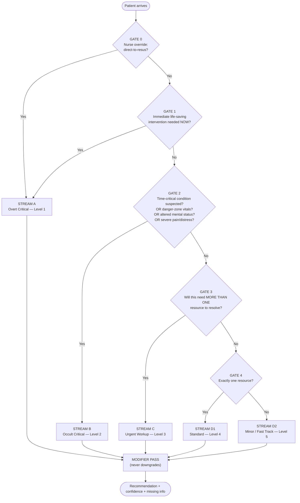
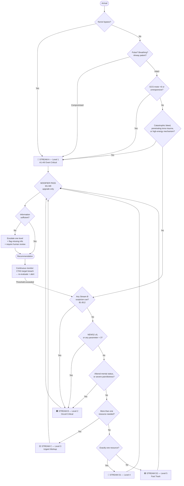

# Patient Classification & Decision Framework

**PatientTriage.ai — routing decision-support scaffolding**

> ⚠️ **This is a routing framework, not a clinical protocol.** Every threshold, red flag, and cutoff below is drawn from published triage literature but has **not** been clinically validated for this system, this hospital, or this patient population. It is scaffolding for a decision-support prototype. Real deployment requires clinical governance sign-off, local calibration, and regulatory review. Nothing here diagnoses; it routes and prioritises, and a licensed clinician overrides everything.

---

## 1. Why the obvious three-category model breaks

The intuitive split is:

1. Extremely emergency — visibly catastrophic (gunshot, brutal RTA)
2. Internal / invisible but lethal — MI, stroke, "can die on the spot"
3. Normal case, hyped — can safely wait

This is the right instinct but it is **not MECE**, for two reasons.

### Problem 1 — Categories 1 and 2 differ by *detectability*, not severity

A gunshot wound and a silent MI can both be lethal within the hour. They do not belong on the same axis. The real structure is two independent axes:

| | **Obvious** | **Occult (hidden)** |
|---|---|---|
| **High threat to life** | **Stream A** — visibly critical | **Stream B** — the danger zone |
| **Low threat to life** | Stream D — visibly minor | Stream C — needs workup to exclude |

**Stream B is where triage error concentrates.** It is not "less severe than A" — it is *equally lethal and harder to see*. Treating detectability as if it were severity is precisely how patients get under-triaged.

### Problem 2 — The middle is missing

"Normal case, nothing is gonna happen" collapses two very different groups:

- Patients needing **multiple resources and urgent workup** (abdominal pain needing labs + imaging + review) — the single largest ED population. They will not die in the waiting room, but calling them "nothing is gonna happen" is wrong.
- Patients needing **one or zero resources** (prescription refill, dressing check) — genuinely safe to wait.

### The fix

Four streams, assigned by an **ordered gate cascade**. Order guarantees mutual exclusivity (first match wins, patient exits). A terminal catch-all gate guarantees collective exhaustiveness.

---

## 2. The MECE gate cascade

Adapted from the **Emergency Severity Index (ESI)** four-decision-point algorithm, which is itself a validated MECE cascade: *A) needs immediate life-saving intervention? → B) high-risk / shouldn't wait? → C) how many resources? → D) do vitals upgrade this?*

We add **Gate 0** (the nurse bypass you identified as missing) and make Gate D a cross-cutting modifier rather than a stage.

**MECE proof sketch**
- *Mutually exclusive:* gates are evaluated in fixed order; the first `Yes` terminates and assigns exactly one stream.
- *Collectively exhaustive:* Gate 4's `No` branch is unconditional — every patient not caught earlier lands in D2.
- *Modifiers are not categories.* They adjust acuity **upward only** and never reassign the stream, so they cannot break exclusivity.

---

## 3. Gate 0 — The nurse bypass (currently missing from the app)

You correctly identified this gap: a nurse looking at a catastrophic case must not be forced through an 8-step wizard.

**Trigger:** a single always-visible control on the intake screen — *"Immediate — bypass to resus."*

**Behaviour**
1. Immediately assigns Level 1, pathway = Resuscitation / Critical Care Bay.
2. Fires the resus alert **before** any data entry.
3. Opens a minimal 4-field capture (approximate age, sex, presenting problem, time of onset) — everything else deferred.
4. Logs `NURSE_DIRECT_RESUS_OVERRIDE` with nurse ID + timestamp; the encounter is back-filled later.

**Design principles**
- **Never blocked, never confirmed twice.** One tap. A confirmation dialog costs seconds that matter.
- **No AI in the path.** Gate 0 must work with the network down and no model reachable.
- **Over-use is acceptable and expected.** A false Gate-0 activation costs one unnecessary resus mobilisation. A missed one costs a life. The asymmetry is the entire point — but the *rate* must be monitored, because a nurse triggering it constantly signals either a training gap or a genuinely under-resourced department.

---

## 4. Stream A — Overt Critical (Level 1)

**Definition:** threat to life is *visible on arrival*, requiring life-saving intervention within minutes. Recognition is not the hard part; speed is.

Anchored on **ESI Decision Point A** (immediate life-saving intervention) and the **2021 CDC Field Triage Guidelines RED criteria**.

| Code | Sub-class | Recognition cues | Pathway |
|---|---|---|---|
| **A1** | Cardiac / respiratory arrest | No pulse, no/agonal breathing | Resus |
| **A2** | Airway compromise | Stridor, gurgling, unable to speak, facial/inhalation burns | Resus |
| **A3** | Catastrophic haemorrhage | Pulsatile/uncontrolled external bleed, amputation | Resus + Trauma |
| **A4** | Penetrating trauma — torso/head/neck | Gunshot, stab to head/neck/torso/proximal limb | Resus + Trauma |
| **A5** | Major blunt trauma | High-energy mechanism, chest-wall instability, ≥2 proximal long-bone fractures, crushed/degloved limb, pelvic instability | Resus + Trauma |
| **A6** | Unresponsive / profound AMS | GCS motor score <6, unresponsive to voice or pain | Resus |
| **A7** | Status epilepticus | Active or repeated seizure without recovery | Resus |
| **A8** | Severe burns / inhalation | Large TBSA, circumferential, airway involvement | Resus + Burns |
| **A9** | Shock — decompensated | Profound hypotension with altered perfusion | Resus |

> **Note on A5:** the 2021 CDC guidelines simplified the neurological criterion to **GCS motor score <6** for identifying patients needing the highest-level trauma centre. This is a deliberately blunt, fast field measure — appropriate for Gate 1, where speed beats precision.

---

## 5. Stream B — Occult Critical (Level 2) ⚠️ **the highest-value stream**

**Definition:** a time-critical, potentially lethal or disabling condition is *plausible* but not externally visible. The patient may look well, walk in, and talk normally.

This is where the system earns its existence. The evidence on why:

- **Five conditions account for ~39% of serious misdiagnosis-related harms in EDs:** stroke, myocardial infarction, aortic aneurysm/dissection, spinal cord compression/injury, and venous thromboembolism.
- **Stroke is missed an estimated ~17% of the time** — the single largest harm-producing diagnostic error.
- **Aortic dissection:** roughly a **1-in-6 miss rate** in one Swedish ED series; missed cases were *more* likely to present with ischaemic ECG changes and an initial suspicion of ACS — i.e. the near-miss looks like a different diagnosis, not like nothing.
- Missed AMI is estimated to cause **~10,000 potentially preventable harms annually in the US**.

**The design consequence:** Stream B must be entered on **suspicion, not confirmation**. The gate asks *"could this be X?"* — never *"is this X?"*. Diagnosis is explicitly out of scope; the system routes for exclusion.

### B sub-classification

| Code | Sub-class | Why it hides | Cannot-miss cues |
|---|---|---|---|
| **B1** | Acute coronary syndrome | Atypical/silent presentation common | Chest discomfort, *or* isolated dyspnoea, epigastric pain, nausea/vomiting, fatigue, syncope, new confusion |
| **B2** | Stroke / TIA | Deficits subtle, fluctuating, or resolved on arrival | Face/arm/speech change, sudden weakness, numbness, visual loss, worst-ever headache, ataxia, **known last-well time** |
| **B3** | Aortic dissection / AAA | Mimics ACS; ECG may mislead | Tearing/migrating pain, back/flank pain, pulse or BP differential, syncope with pain |
| **B4** | PE / VTE | Non-specific, often just breathlessness | Pleuritic pain, unexplained dyspnoea/tachycardia, unilateral limb swelling, recent immobility/surgery |
| **B5** | Sepsis / occult infection | Early sepsis looks like malaise | Suspected infection **+** physiological derangement (see NEWS2 below) |
| **B6** | Spinal cord compression | Presents as "back pain" | Saddle anaesthesia, bladder/bowel change, bilateral leg weakness, progressive neuro deficit |
| **B7** | Obstetric emergency | Ectopic can present as GI upset | Abdominal pain / bleeding in reproductive-age female, **pregnancy status unknown counts as positive** |
| **B8** | CNS infection | Early meningitis mimics flu | Fever + headache + neck stiffness/photophobia, non-blanching rash, new confusion |
| **B9** | Occult haemorrhage | Compensated until sudden collapse | GI bleed, post-trauma with normal obs, anticoagulated patient after minor mechanism |
| **B10** | Metabolic / toxicologic | Vague and multi-system | DKA, deliberate ingestion, altered behaviour, hypoglycaemia |
| **B11** | Time-critical organ torsion | Presents as "just pain" | Testicular / ovarian torsion — organ salvage is hour-dependent |
| **B12** | Time-critical sensory loss | Painless or dismissed | Acute angle-closure glaucoma, central retinal artery occlusion, sudden monocular vision loss |

### Physiological trigger — NEWS2

For occult deterioration, physiology outperforms narrative. **NEWS2** scores seven parameters (respiratory rate, SpO₂, supplemental oxygen, temperature, systolic BP, heart rate, consciousness via ACVPU) each 0–3.

Royal College of Physicians response thresholds:

| NEWS2 | Risk | Response |
|---|---|---|
| 0 | Low | 12-hourly observations |
| 1–4 | Low | 4–6 hourly, ward-based review |
| **5–6, or any single parameter = 3** | **Medium** | Hourly obs, **urgent review** |
| **≥7** | **High** | Continuous monitoring, **immediate emergency response** |

**≥5 with suspected infection triggers a sepsis bundle assessment** (UK Sepsis Trust).

Why NEWS2 over qSOFA for this gate: sensitivity for sepsis detection was **86% (NEWS >5) vs 34% (qSOFA ≥2)**. For an under-triage-averse system, sensitivity is the correct thing to optimise — qSOFA's better positive predictive value matters less when the cost of a miss dominates.

> **Not yet implemented.** The app currently uses individual vital thresholds, not a composite score. Adopting NEWS2 would replace several invented cutoffs with a published, validated instrument — this is the single highest-value change available to the routing engine.

---

## 6. Stream C — Urgent Workup (Level 3)

**Definition:** Streams A and B excluded, but the patient needs **more than one resource** to reach disposition. Largest ED population. Will not deteriorate imminently *if* re-assessment happens on schedule.

Resource counting follows ESI Decision Point C. **A "resource" is a distinct diagnostic or therapeutic action** — labs, ECG, imaging, IV fluids/medication, specialist consult, procedure. History, exam, and simple prescriptions do **not** count.

| Code | Sub-class | Typical pattern |
|---|---|---|
| **C1** | Undifferentiated abdominal pain | Labs + imaging + review |
| **C2** | Moderate injury | Imaging + analgesia + possible reduction |
| **C3** | Stable respiratory | Established asthma/COPD, responding |
| **C4** | Non-critical infection | Requires labs ± IV antibiotics |
| **C5** | Stable psychiatric / behavioural | Assessment + risk screen, no immediate self-harm risk |
| **C6** | Symptomatic chronic disease | Stable but needs workup |
| **C7** | Moderate obstetric (non-emergent) | Assessment + monitoring |

**C's dominant failure mode is not mis-assignment — it is neglect.** These patients are correctly triaged and then wait. This is exactly what the automatic queue monitor exists to catch (§9).

---

## 7. Stream D — Low Acuity (Levels 4–5)

| Code | Sub-class | Resources | Level |
|---|---|---|---|
| **D1a** | Simple injury needing imaging *or* procedure | One | 4 |
| **D1b** | Symptom needing one lab or one treatment | One | 4 |
| **D2a** | Minor wound / dressing / suture check | None | 5 |
| **D2b** | Prescription, certificate, routine review | None | 5 |
| **D2c** | Reassurance-seeking, no red flags | None | 5 |

**The safety trap:** D is assigned by *exclusion*, so it inherits every miss from Gates 1–3. A Stream B patient wrongly routed to D is the worst outcome the system can produce. Two mitigations:

1. **D assignment always requires the modifier pass (§8) to have run and returned clean.**
2. **Time-based re-screen.** Any D patient whose wait exceeds the CTAS target is automatically re-evaluated — a D patient still present at 120 minutes was either mis-triaged or has deteriorated.

---

## 8. The modifier pass — cross-cutting, upgrade-only

Modifiers are **not** categories. They apply after stream assignment, may only raise acuity, and never reassign stream. This is what keeps the framework MECE while still capturing risk that cuts across all streams.

| ID | Modifier | Rationale | Effect |
|---|---|---|---|
| **M1** | Age extreme — infant (<2) / geriatric (≥65) | Physiological reserve and presentation differ | Upgrade + age-specific thresholds |
| **M2** | **Atypical-presentation risk group** | See below | Lower threshold for Stream B |
| **M3** | Pregnancy — known *or unknown* | Unknown status must be treated as possible | OB pathway consideration |
| **M4** | Anticoagulated | Minor mechanism can cause major bleed | Upgrade after any head trauma |
| **M5** | Immunocompromised | Blunted infection signs | Lower sepsis threshold |
| **M6** | Communication barrier | Language, dementia, intoxication, non-verbal | Reduce confidence, require collateral |
| **M7** | Re-presentation <72h | Returning = something was missed | Mandatory senior review |
| **M8** | **Geographic / outbreak signal** | See §10 | Isolation + surveillance flag |
| **M9** | Frequent presenter | Anchoring bias risk — most dangerous in patients easy to dismiss | Suppress prior-visit anchoring |

### M2 — the atypical presentation problem

**Who:** older adults, women, diabetics, patients with renal insufficiency.

**What the literature shows:**
- Atypical presentations — **isolated dyspnoea, epigastric pain, or fatigue without chest pain** — are more common in these groups.
- **Diabetic autonomic neuropathy blunts ischaemic pain perception**, producing nausea, vomiting, abdominal discomfort or generalised weakness instead of classic substernal chest pain.
- In elderly diabetics presentation may be "vague, mild, or self-limiting, such that even the physician may fail to consider the possibility." **Acute deterioration of mental status alone can be the presentation of acute coronary disease.**
- Women report classic ACS symptoms less often, and asymptomatic women often have *worse* prognosis than asymptomatic men.

> **Honesty note:** the literature does **not** support precise prevalence figures here — studies show "highly diverse results." This document deliberately states the *direction* of the effect without inventing a percentage. Any number attached to M2 in code must be a labelled, hospital-tunable configuration value, not a fabricated constant.

**Design consequence:** for an M2 patient, the *absence* of the classic symptom must not lower suspicion. In the current engine, chest-pain keywords drive the cardiac pathway — an M2 patient presenting with only nausea and fatigue would not trip it. **This is a live gap.**

---

## 9. Timing model

Wait targets are the published **CTAS** national standards, not invented values:

| Level | Stream | Target to physician | Compliance target |
|---|---|---|---|
| 1 | A | Immediate | 98% |
| 2 | B | 15 min | 95% |
| 3 | C | 30 min | 90% |
| 4 | D1 | 60 min | 85% |
| 5 | D2 | 120 min | 80% |

For context on intake budget: triage assessment itself has a **median of ~2.6 minutes**, with **98% completing under 5 minutes** and a recommended target of **under 5 minutes**. This is a hard design constraint — any intake flow materially exceeding it is not deployable, regardless of how good its data model is.

---

## 10. Geographic & outbreak signal (M8)

Presenting location is a genuine routing input, not demographics:

1. **Cluster detection.** Several patients from one locality with a similar syndrome within a short window is a signal no individual assessment can produce.
2. **Isolation decisions.** Origin from a known active outbreak area changes placement immediately, before any test.
3. **Endemic priors.** Regional disease prevalence legitimately shifts differential weighting.

**Minimum viable implementation**
- Capture locality at intake (area/PIN — **not** full address; DPDP data-minimisation).
- Maintain a rolling syndrome-by-locality count.
- Raise a **surveillance alert**, not a diagnosis, when a threshold is crossed.
- Apply M8 as isolation-pathway consideration only.

> **Deliberate constraint:** geography must **never** downgrade acuity, and must never be used as a proxy for socioeconomic status. It raises isolation and surveillance considerations only. Getting this wrong turns a clinical tool into a discriminatory one.

---

## 11. Master decision flow

### Uncertainty rule

When information is insufficient to *exclude* a Stream B condition, the system escalates one level and flags the gap — it does **not** resolve ambiguity by assuming the benign case. This is the asymmetric-cost principle made concrete: over-triage costs resources, under-triage costs lives, and those are not commensurable.

---

## 12. Implementation status

| Component | Status |
|---|---|
| Ordered gate cascade | ⚠️ Partial — rules exist but not structured as ordered gates |
| Gate 0 nurse bypass | ❌ **Not implemented** |
| Stream A sub-classes | ⚠️ Partial — A1/A2/A6 only |
| Stream B sub-classes | ⚠️ **4 of 12** — B1, B2, B5, B7 approximated by keywords |
| Stream C resource counting | ❌ Not implemented — no resource-count logic |
| Stream D split (4 vs 5) | ⚠️ Keyword-based, not resource-based |
| NEWS2 composite score | ❌ **Not implemented** — individual thresholds only |
| CTAS wait targets | ✅ Implemented |
| M1 age extremes | ✅ Implemented (pediatric + geriatric thresholds) |
| M2 atypical presentation | ❌ **Not implemented — highest-priority gap** |
| M3–M7 modifiers | ❌ Not implemented |
| M8 geography / outbreak | ❌ Not implemented |
| Automatic wait monitoring | ✅ Implemented |
| Confidence scoring | ⚠️ Present but **arithmetically invented** — needs replacing |

### Recommended priority order

1. **Gate 0 bypass** — small, self-contained, removes a real patient-safety gap.
2. **M2 atypical presentation** — highest clinical value; directly addresses the most-missed diagnoses.
3. **NEWS2** — replaces several invented constants with a validated instrument.
4. **Restructure rules into explicit ordered gates** — makes MECE structurally guaranteed rather than emergent.
5. **Resource counting** for genuine C/D1/D2 separation.
6. **M8 geography** — new capability, no precedent in the current model.

---

## 13. Validation requirements

Before any real use, the following require clinical sign-off and local calibration — they are **not** settled by this document:

- All numeric vital thresholds, per age band
- Stream B suspicion cue sensitivity/specificity in the local population
- Resource-count definitions for the specific department
- NEWS2 escalation policy alignment with local protocol
- Outbreak-detection thresholds and privacy review (DPDP)
- Gate 0 activation-rate monitoring and audit
- Over-triage / under-triage rate measurement against clinician-adjudicated ground truth

---

## Sources

**Triage systems & algorithms**
- [ESI Handbook, Fifth Edition](https://media.emscimprovement.center/documents/Emergency_Severity_Index_Handbook.pdf)
- [ESI four decision points overview](https://blog.triageiq.com/mastering-the-emergency-severity-index-esi)
- [CTAS national targets](https://pub-haldimandcounty.escribemeetings.com/filestream.ashx?DocumentId=3293)
- [Triage systems compared — MTS, ESI, CTAS, ATS, SATS](https://blog.triageiq.com/triage-systems-compared-a-comprehensive-analysis-of-mts-esi-ctas-ats-and-sats)

**Diagnostic error & missed diagnoses**
- [Diagnostic Errors in the Emergency Department: A Systematic Review (AHRQ)](https://www.ncbi.nlm.nih.gov/books/NBK588123/)
- [Unrecognized Cardiovascular Emergencies Among Medicare Patients](https://pubmed.ncbi.nlm.nih.gov/29482196/)
- [Missed acute MI — SPADE method (AHRQ PSNet)](https://psnet.ahrq.gov/issue/missed-acute-myocardial-infarction-emergency-department-standardizing-measurement)
- [Missed acute aortic syndrome and ischaemic ECG changes](https://pubmed.ncbi.nlm.nih.gov/41315990/)
- [Missed Diagnoses of Acute Cardiac Ischemia in the ED (NEJM)](https://www.nejm.org/doi/full/10.1056/NEJM200004203421603)

**Atypical presentation**
- [Atypical presentation of coronary artery disease in diabetics](https://pubmed.ncbi.nlm.nih.gov/25228959/)
- [ACS in Special Populations: Women, Diabetic, and Elderly Patients](https://www.intechopen.com/chapters/1221511)
- [Atypical Presentations of MI: A Systematic Review of Case Reports](https://www.ncbi.nlm.nih.gov/pmc/articles/PMC10048062/)

**Physiological scoring**
- [NEWS2 superior to qSOFA in detecting sepsis with organ dysfunction](https://www.ncbi.nlm.nih.gov/pmc/articles/PMC6723972/)
- [NEWS outperforms qSOFA for early sepsis detection in the ED](https://www.ncbi.nlm.nih.gov/pmc/articles/PMC9686998/)
- [NEWS2 vs qSOFA for mortality prediction in sepsis, India](https://pmc.ncbi.nlm.nih.gov/articles/PMC10167809/)

**Trauma field triage**
- [2021 National Field Triage Guidelines (EMS.gov)](https://www.ems.gov/assets/FTG-FICEMS-presentation-5.2022.pdf)
- [National guideline for field triage of injured patients, 2021](https://journals.lww.com/jtrauma/fulltext/2022/08000/national_guideline_for_the_field_triage_of_injured.19.aspx)

**Triage timing**
- [Triage performance timing — regional multicentre study, Italy](https://www.sciencedirect.com/science/article/abs/pii/S1755599X15001238)
- [Triage duration times — level 1 ED prospective study](https://pubmed.ncbi.nlm.nih.gov/28485904/)
- [CTAS implementation, tertiary care centre](https://www.ncbi.nlm.nih.gov/pmc/articles/PMC3042416/)
